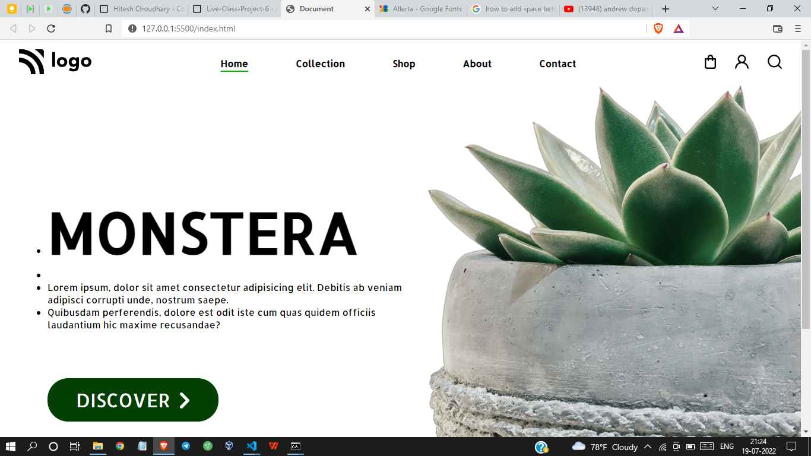

# Project 6 - HTML  and CSS 

By Shreesha

Here's the Live Deployed Website of 

## Project 06  [DEPLOYED LINK](https://project06-plant-home-page.netlify.app/)

# What did I learn in this project

- I got to learn about the   positioning of images 
- Got to learn about the flexbox.
- got to learn how to design buttons 
- Also got to learn about using the icons.

## Time taken to complete project is 2 hours
